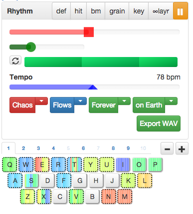

# Crowd Remix

I have created the most powerful concatenative synthesizer / crowd-source remix engine known to man. 

[**Play with Crowd Remix**](http://cortexel.us/crowdremix)

[Listen to example of song created and performed entirely within Crowd Remix](https://cortexelation.bandcamp.com/track/freeedm-etude-op-1-no-1)

# How it works

Search for any song on EchoNest. Local music and your friends music is preferable, because popular music is an echo chamber; music is popular because it's popular. 

It creates a Color Palette of the song using my algorithm:
  1. Segmentation. 
  2. 12-dimensional vector of timbre features for each segment.
  3. Hierarchical clustering of segment vectors. 
  4. Flatten hierarchy to one dimensional array. Similar to how you would turn a binary tree into a linked list.
    
  5. Map to hue. 

#### Build rhythms with color
  * Euclidean rhythms sound really good
  * Concatenative Synthesis is good for glitch/textures/rhythms
  * Export loops and drag them into your DAW (Ableton Live, etc)

#### Jam with keyboard
  * Press key and save loop.
  * Recall with same key. 
  * Hit ` to open Chaos Notes. Store composition notes inside. 
  * Loops are saved to database, updated concurrently for any user on that same page. 

#### Efficient Production
  * Instead of sequencing, build new parts by exploring the space of permutations of old songs
  * Speeds up my music *tenfold*
  * Good for teaching beginners

## Options
#### Segment choice
  * **Chaos** randomize segments
  * **Order** segments don't change

#### Short segment behavior
  * **Flows** segment continues on as it would in the original song (which may introduce new timbre) before jumping to next segment in loop
  * **Gaps** segments end abruptly, introducing silence before next segment in loop

#### Loop Behavior
  * **Forever** Loop loops
  * **Once** Loop plays once, then silence
  * **And so on** after loop, final segment continues on as it would in the original song

#### Layer
 * **On Earth** Layer 1. All loops on layer 1 interrupt each other, but do not interrupt others.
 * **On Neptune** Layer 2. All loops on layer 2 interrupt each other, but do not interrupt others.
 * **In Space** No layer. These loops cannot be interrupted. Only the pause button can stop them. 

### Presets
 * **def** Order flows forever on Earth; default loop pattern
 * **hit** Order gaps once in space; one-time hit
 * **bm** Order flows and so on on Earth; BookMark a point in the song
 * **grain** Order flows forever on Earth, hi-tempo; for granular textures
 * **key** Chaos flows once on neptune, very-high tempo; for pitched granularity when controlling with a midi keyboard
 * **infinite layer** Chaos flows once in space; building up heavy textures

# TODO
  * Combining this a body-controlled MIDI interface. (Fuck being on stage, be in the audience and make music by dancing)
  * Collaborate with as many musicians as possible. 
  * Teach more people beginner production with this tool
  * Release music video remixer
  * Option to upload music
  * Option to remix soundcloud, youtube, bandcamp
  * Use state machines to build automated indeterminate patterns
    * "Learn" from how user plays sampler; then continues to play on its own
    * Markov model of sampler triggers
    * A node in one state machine can be another state machine, which allows for large complexity of patterns
    * See http://remix.army for my future plans
